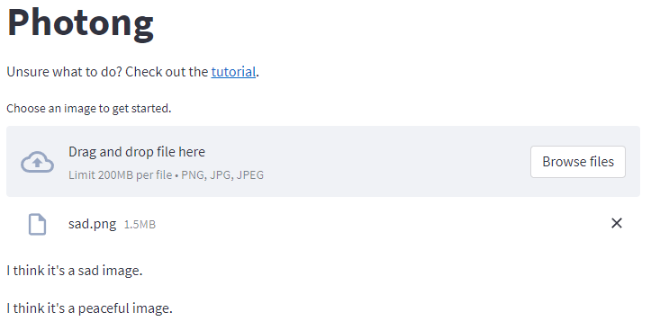
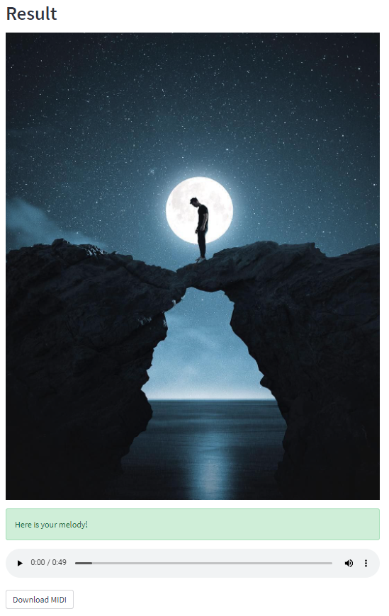
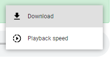

## Using Photong
When you first open the page, you may see a few spinners and loading texts. Please wait patiently until they disappear. Then you should see a file uploader.

Click on the uploader. You will be prompted to select an image. Note that only images with extensions `.png`, `.jpg` and `.jpeg` images are supported.

After the image is uploaded successfully, the app will start running a sequence of steps. Eventually, it will tell you if it thinks the image is happy or sad, exciting or peaceful.

The generation process may take a while, during which some models may need to be downloaded and loaded in the app.

If the process succeeds, you will see a new section called "Result". The app will show you the original image you uploaded and a green box that says "Here is your melody!". Below this box, you should be able to see a music player that can play the melody for you. Click on the play triangle button to listen to the generated melody.

To save the generated melody, you can click on the three dots on the right of the music player and select "Download". The audio file will automatically be saved to your computer.

Alternatively, you can click on the "Download MIDI" button below the music player and save the MIDI file to your computer. A MIDI file can be opened by any musical notation or production software, such as [MuseScore](https://musescore.org/) or any DAW (Digital Audio Workstation) software.

If you run into a problem, please [open an issue](https://github.com/leranjun/photong-web-app/issues/new).
